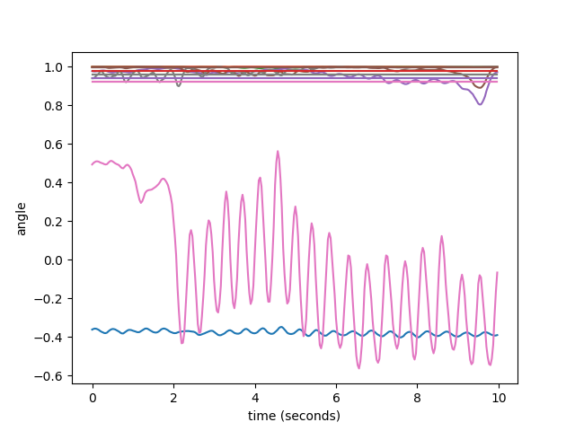

# motion transformer diffusion

## 模型介绍

* `post_mt_diffusion`: 后验Transformer diffusion, 编码了未来信息的 _context_ 和历史姿态同时作为输入。

* `prior_mt_diffusion`: 先验Transformer diffusion, 仅用历史姿态作为输入。

* `psyPred`: 用过去姿态得到未来 _context_ 的分布，从而预测未来的姿态。

## 数据集

从AMASS下载数据集。

## 训练

```
python3 train_mt_multi_diffusion.py
```

## 实时检测

预测曲线


真实曲线



## 方法提出

* 我们希望提出了一种能够建模不确定性的多步预测方法，其中未来动作的不确定性由扩散模型的采样来决定。
* 我们希望能模拟不同条件下的预测，用条件和历史输入共同决定未来的动作。我们希望有额外条件输入的和没有额外条件输入的情况下，二者无论隐层还是最终输出结果不会相差太多。因此我们受卡尔曼滤波后验修正的启发，提出一种称为后验旋转`PosteriorRotation`的模块。

该模块会将条件输入用一个微旋转矩阵表示，并将该旋转矩阵作用于SelfAttention的Key模块上，用来改变模型对过去信息的权重分布，从而影响输出。

