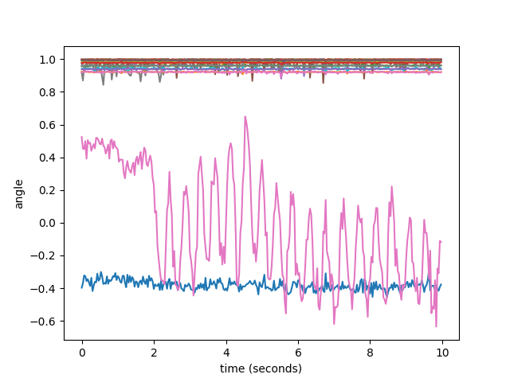

# motion transformer diffusion

## 模型介绍

* `post_mt_diffusion`: 后验Transformer diffusion, 编码了未来信息的 _context_ 和历史姿态同时作为输入。

* `prior_mt_diffusion`: 先验Transformer diffusion, 仅用历史姿态作为输入。

* `psyPred`: 用过去姿态得到未来 _context_ 的分布，从而预测未来的姿态。

## 数据集

从AMASS下载数据集。

## 训练

```
python3 train_mt_multi_diffusion.py
```

## 实时检测

预测曲线


